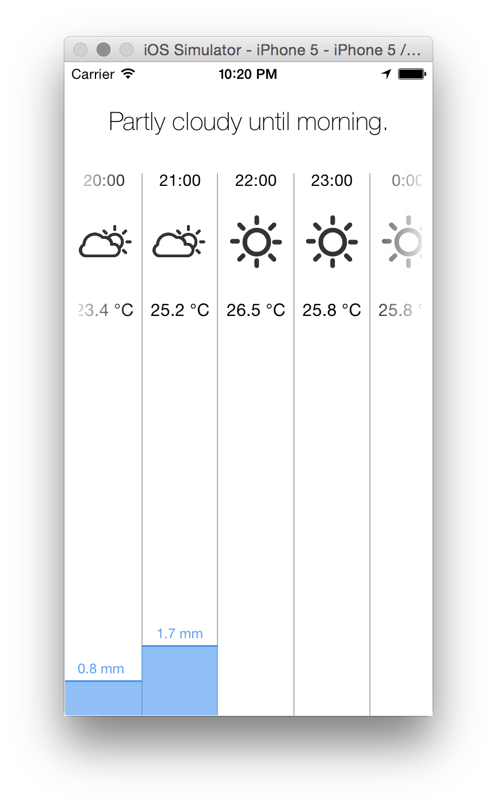

# Simple Weather
A very simple weather app for iOS using the [forecast.io API](http://forecast.io/).

This is how the finished app will look. There is currently some work left before it actually looks that way. 

This project was done to learn about the development workflow when using XCode and Swift. 

I did not have much experience with Swift and iOS development in general before starting the project, and the finished project might therefore not follow all iOS and Swift best practices. 

